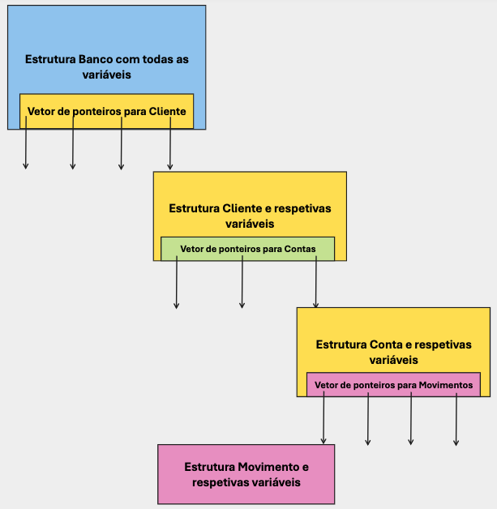
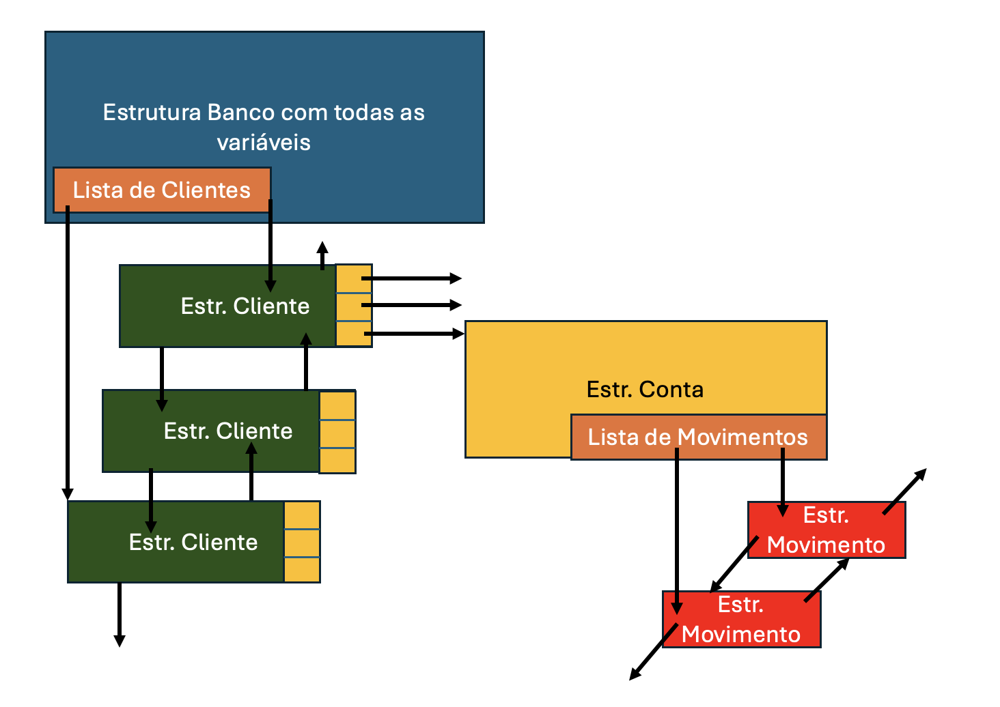

# Projeto Sistema de Gestão Bancária 

- [Projeto Sistema de Gestão Bancária](#projeto-sistema-de-gestão-bancária)
  - [Lista de alterações e versões ao enunciado](#lista-de-alterações-e-versões-ao-enunciado)
  - [Grupos de Trabalho (TPSI PL 1223)](#grupos-de-trabalho-tpsi-pl-1223)
  - [Enquadramento](#enquadramento)
  - [Modelo de Dados](#modelo-de-dados)
    - [Movimento bancário](#movimento-bancário)
    - [Conta Bancária](#conta-bancária)
    - [Cliente](#cliente)
    - [Banco](#banco)
    - [Exemplos de modelo de dados](#exemplos-de-modelo-de-dados)
  - [Funcionalidades a implementar](#funcionalidades-a-implementar)
  - [Menus e Especificação das Funcionalidades](#menus-e-especificação-das-funcionalidades)
    - [Entradas do Menu Principal](#entradas-do-menu-principal)
    - [Entradas do Menu Clientes](#entradas-do-menu-clientes)
    - [Entradas do Menu Contas](#entradas-do-menu-contas)
    - [Entradas do Menu Movimentos](#entradas-do-menu-movimentos)
  - [Estrutura de Ficheiros fornecidos](#estrutura-de-ficheiros-fornecidos)
  - [Avaliação e data de entrega](#avaliação-e-data-de-entrega)
  - [Testes à aplicação](#testes-à-aplicação)
    - [Descrição dos Testes](#descrição-dos-testes)
    - [Execução dos testes](#execução-dos-testes)
  - [Boas Práticas](#boas-práticas)
    - [Compilação](#compilação)
    - [Formatação](#formatação)
    - [Comentários](#comentários)
    - [Organização do código](#organização-do-código)
    - [Constantes](#constantes)
    - [Exemplo de boas práticas nos comentários](#exemplo-de-boas-práticas-nos-comentários)


## Lista de alterações e versões ao enunciado

* **2024-03-20:** Upload e distribuição do trabalho

## Grupos de Trabalho (TPSI PL 1223)

* Grupo 1:
  * Pedro Marques
  * Marco Cândido
  * Miguel Barroso
* Grupo 2:
  * João
  * Ruben
  * Vladimiro
* Grupo 3:
  * Lucas Silvestre
  * Bernardo
  * Daniel
* Grupo 4:
  * Alexandre
  * Vasile
  * Gonçalo
* Grupo 5:
  * Lucas Patricio
  * Vasco
  * Marco Martins
* Grupo 6:
  * Leila
  * Iuri
  * Olesea
* Grupo 7:
  * Benedita
  * Mauro
  * Diogo


## Enquadramento
Entende-se por Sistema de Gestão Bancária sistemas que visam implementar soluções de modo a automatizar/apoiar na realização de tarefas das entidades ligadas ao setor da banca.

Neste projeto final da Unidade Curricular, pretende-se criar uma aplicação que possa, de uma forma muito limitada gerir uma pequena instituição bancária.

## Modelo de Dados
Após uma análise sobre as necessidade de informação da instituição, bem como um estudo sobre os processo a automatizar, foi identificado o seguinte modelo de dados/processos:

### Movimento bancário
Todos os movimentos/Operações bancárias devem ser registados. Contudo a aplicação não será testada com mais de 100 movimentos para uma conta. Cada movimento é identificado por:
- id: Um número inteiro (int) gerado pela aplicação, sendo que o primeiro movimento possuirá o `id=1` , o segundo o `id=2` e daí em diante segue a mesma norma. Não existem dois movimentos com o mesmo ID (mesmo de contas ou clientes distintos. O id é único no banco);
- tipo de movimento: Pode se um de quatro `DEPÓSITO ; LEVANTAMENTO ; TRANSFERÊNCIA ; JURO`;
- valor: Número real que quantifica o movimento. Deverá ser um valor negativo caso se retire dinheiro da conta e positivo se estamos a adicionar. O somatório dos valores de todas as transferências tem que ser igual ao saldo da conta.
- dia: Data em que se realizou o movimento.
- Cliente: id do cliente que do movimento.
- Conta: id da conta do movimento

> Na aplicação, irá ser necessário listar os movimentos referentes a contas específicas, e referentes ao banco, de forma global. Ou seja, os movimentos devem ser guardados em duas listas. Numa lista referente ao banco (que nunca é apagada, mesmo que se apaguem clientes ou contas) e numa lista referente a cada conta, que são apagados quando se fecha a conta ou se remove um cliente.

> **Importante para definição de modelo de dados**: Em todas as listagens de movimentos, estes serão sempre impressos por ordem cronológica, ou seja de forma crescente pelo valor do seu id (que é único para cada movimento)

**Conceitos importantes relativamente a movimentos:** 
- Entende-se por **depósito** a ação do cliente em adicionar dinheiro à sua conta bancária
- Entende-se por **levantamento** a ação do cliente subtrair dinheiro à sua conta bancária
- **Transferência** é o processo de movimentar capital entre contas. Por simplificação, neste projeto, as transferências são só efetuadas entre contas do mesmo banco (podendo ser, ou não, pertencentes ao mesmo cliente), sendo que para cada transferência devem ser criados, sempre, dois registos de movimento bancário, um positivo na conta de destino e outro negativo na conta de origem.
- O movimento **Juros** é um movimento de crédito, ou débito, efetuado numa determinada conta para efeito de aplicação de uma taxa de juro diária, consoante a conta possui um saldo positivo, ou negativo, respetivamente.

### Conta Bancária
Entende-se por Conta Bancária como um produto colocado, pelo Banco, à disposição do cliente, onde este pode depositar, levantar, ou transferir dinheiro. Na nosso instituição bancária existe a facilidade de um cliente possuir uma conta a descoberto, contudo qualquer operação de débito **nunca poderá ser autorizada** se daí resultar um saldo negativo na sua posição integrada (soma dos saldos de todas as contas de um cliente). Por outro lado, por simplificação, cada conta bancária só pode pertencer a um titular, podendo este efetuar todas as operações, sobre a conta, disponíveis na aplicação. 

Cada Conta bancária possuirá, pelo menos, os seguintes atributos:
- Saldo (double)
- Código de Identificação da Conta: (array de caracteres - string) Não existem números de conta repetidos. O código de identificação da conta possuirá exatamente 3 caracteres, sendo composto por literais e algarismos.

### Cliente
Um cliente é uma entidade que, através de um contrato com o banco, pode aceder a um conjunto de serviços disponíveis na Instituição Bancária. Por simplificação do projeto um cliente só pode possuir até o máximo de 3 contas bancárias. Cada cliente é identificado pelo seguinte conjunto de atributos:
- Id de cliente: inteiro que deverá se gerado automáticamente pela aplicação, de forma sequencial, sendo que o primeiro cliente possuirá o `id=1`, o segundo `id=2`, etc. *Caso seja removido um cliente, esse número não voltará a ser atribuído, mesmo que o mesmo cliente se registe novamente*.
- Nome: Máximo de 100 caracteres;
- Posição integrada: Valor real (double) que possui o saldo integrado de todas as contas do cliente. Não são permitidas efetuar operações que deixem um cliente com a sua posição integrada negativa.
- nif: String de exatamente 9 dígitos, não podendo haver clientes com o mesmo nif. Um cliente que deixe, a determinado momento, de ser cliente, pode voltar a ser novamente cliente

> **Importante**: No seu modelo de dados, deve considerar, para cada cliente, algumas variaveis que permitam responder facilmente às seguintes questões:
> - Quantas contas o cliente possui no momento?
> - Qual o valor total de dinheiro que o cliente possui em todas as suas contas (saldo integrado)?

### Banco
O banco é identificado pelo nome "ATEC BANK". Além disse o banco deve possuir:
- Capacidade para um conjunto ilimitado de clientes. Contudo a aplicação não será testada para mais de 30 clientes;
- Deverá ser facilmente acessível o valor global monetário armazenado no nosso banco (Ou seja o valor em cofre do banco);
- Valor do juro a cobrar, por dia, nas contas a descoberto (contas com saldo negativo). Considera-se sempre um juro de `5%`, ou seja,  `0.05`
- Valor do juro a considerar para bonificar as contas com saldo positivo. Considera-se sempre um juro de `1.5%`, ou seja,  `0.015`.
  
 - A aplicação que gere o nosso banco terá, ainda, que ter a capacidade de guardar a data atual. Para efeitos de simplificação, a data é um `int` que quando a aplicação inicia terá o valor de `data=0`. Existirá uma entrada de menu que permite incrementar a data (avançar no tempo), sendo que quando isso acontecer, as taxas de juro serão automáticamente aplicadas a todas as contas, gerando um movimento bancário do tipo `JURO`. Fruto da aplicação das taxas de juro, a posição integrada do cliente poderá ficar negativa até que este efetue um deposito.

> **Importante:**: No seu modelo de dados, a estrutura que representa o banco pode conter outras variáveis para guardar, por exemplo, o saldo total em cofre (somatório do saldo de todas as contas), o número total de clientes do banco, o numero total de contas existentes, ou um inteiro que guarde o último dia em que foi atualizado o juro. Estes dados poderão ser necessários  em resposta a alguns pedidos.

### Exemplos de modelo de dados

O modelo de dados pode ser implementado através de Arrays de dimesnsão fixa (o que é uma limitação), sendo que esta abordagem, apesar de mais fácil, irá introduzir uma penalização na nota final



Ou pode ser implementada com listas para inserção de clientes e movimentos:




## Funcionalidades a implementar
A nossa aplicação terá que implementar um conjunto de funcionalidades, nomeadamente:
- Avançar Data
- Pagar/Cobrar Juros
- Inserir Cliente
- Listar Clientes
- Mostrar Cliente
- Apagar Cliente
- Procurar Cliente
- Criar Conta Bancária
- Listar Contas de Cliente
- Mostrar Conta de Cliente
- Depositar Dinheiro
- Levantar Dinheiro
- Efetuar Transferência
- Informação do Banco
- Informação do Banco Completa
- Lista de movimentos do Banco
- Melhores cinco clientes

## Menus e Especificação das Funcionalidades

### Entradas do Menu Principal
1. **Menu Clientes**: Acesso ao menu clientes. Funcionalidade já implementada
2. **Menu Contas**: Acesso ao menu Contas. Funcionalidade já implementada
3. **Menu Movimentos**: Acesso ao menu movimentos das contas. Funcionalidade já implementada
4. **Informação do Banco**: Deve apresentar Informação sobre o banco. Nomeadamente o número de clientes total, o número de contas total, o valor total do dinheiro existentes no banco. Esta informação deve ser impressa no ecrã invocando a macro `SHOW_BANK_INFO(DATA,NOME,NUM_CLIENTES,NUM_CONTAS,SALDO_TOTAL)` presente em sgb.h. Exemplo do output:
   ```text
   ####  ATEC Bank  ####
   Data Atual: 0
   Clientes: 5
   Contas: 8
   Valor em Cofre: 123.40 €
   ``` 

5. **Informação do Banco Completa** : Imprime todos os clientes e as respetivas contas ativas (existentes à data no banco). Para cada conta imprime ainda os últimos 5 movimentos existentes (os mais recentes, ou seja ordenado por id de forma decrescente). Caso não existam 5 movimentos na conta, imprime os que existirem (pode ser 0). Para cada cliente as contas são impressas ordenadas alfabeticamente pelo seu código (id). Os clientes são impressos ordenados alfabeticamente, pelo nome do cliente (Para simplificação, assume-se que nunca irão existir clientes com o mesmo nome). Esta operação resulta em:
   -  Resposta de Sucesso:
      -  Imprimir a MACRO a macro `SHOW_BANK_INFO(DATA,NOME,NUM_CLIENTES,NUM_CONTAS,SALDO_TOTAL)`
      -  De seguida, imprime a Informação de cada cliente (caso hajam) através da Macro `CLIENT_INFO(DATA,ID,NIF,NAME,NUM_ACCOUNTS,TOTAL_VALUE)`. Para cada cliente deve ainda imprimir:
         -  Informação de cada conta através da macro `CLIENT_INFO_ACCOUNTS(ID_CONTA,SALDO)`. As contas devem ser mostradas por ordem alfabética do `<num_conta>`
          - Os 5 últimos Movimentos da Conta através da macro (deve-se invocar a macro uma vez por cada movimento). Os movimentos devem ser apresentados por ordem decrescente do seu ID`CLIENT_INFO_MOVEMENTS(ID_MOV,TIPO,VALOR)`

6. **Lista de Movimentos do Banco**: Neste caso pretende-se imprimir todos os movimentos do Banco. A execução deste comando deve fornecer um dos seguintes outputs:
   - Resposta de Erro quando não existirem clientes no Banco, através da Macro `NO_MOVIMENTS_ERROR`.
   - Resposta de Sucesso:
     - Escrever Cabeçalho da lista de movimentos através da Macro: `IST_BANK_MOVEMENTS_HEADER(TOTAL_MV)`
     - Por cada movimento utilizar a Macro: `LIST_BANK_MOVEMENTS_ITEM(ID,DIA,ID_CLIENTE,CODE_CONTA,TIPO,VALOR) `

7. **Avançar Data**: Para avançar a data deve solicitar ao utilizador um inteiro, positivo (`>0`). Na operação de avançar a data, os juros devem ser atualizados e os valores das contas também atualizados. Esta operação irá produzir uma de duas respostas:
   -  Resposta de sucesso: Deverá ser escrito no ecrã a nova data e o valor total da atualização dos juros. Pode ser feito através da Macro `NEW_DATE_OK(DATE,JUROS)`, sendo que `DATE` é a nova data e `JUROS` é o somatório de todas as atualizações feitas nas contas.
   -  Resposta de erro quando o número de dias inserido pelo utilizador é `<=0`. Deve ser usada a macro `NUMBER_OF_DAYS_INCORRECT(DIAS)`

8. **Lista melhores clientes do Banco**:Apresentar a Lista dos cinco melhores clientes do Banco, devendo a lista estar ordenada, de forma crescente pelo valor da posição integrada do cliente (Clientes com mais fundos primeiro). No caso de haver dois clientes com a mesma posição integrada, aparecem primeiro os clientes mais antigos (menor ID). Este comando deve produzir um dos seguintes outputs:
   - Resposta de erro: `Erro! Não existem clientes no banco`, através da macro `NO_CLIENTS_ERROR`
   - Resposta de Sucesso:
     - Impressão do Header, através da MAcro `LIST_BEST_CLIENTS_HEADER`
     - Por cada cliente através da Macro `LIST_BEST_CLIENTS_ITEM(ID,NIF,NAME,TOTAL_VALUE)`

9.  **Saír da aplicação**: Já implementado

### Entradas do Menu Clientes

1. **Inserir Cliente**: Para inserir um cliente deve solicitar, por esta ordem, o nome (string) e nif do cliente (String). Para estes pedidos deve utilizar a função `void pedirString(char *dest, char *msg, int max_char)` e as macros `ASK_NAME` e `ASK_NIF` declaradas no ficheiro sgb.h. Além destes campos, não se esqueça que a aplicação tem que gerar um inteiro como id do cliente.Esta operação retorna uma das seguintes mensagens:
   - `Cliente <id>, <nome>, inserido com sucesso`: Quando o cliente é introduzido com sucesso. Para o efeito eve ser utilizada a macro `INSERT_CLIENT_SUCESS(ID,NAME)`
   - `Erro! Cliente com <nif> já existe!`: A apresentar se o nif do Cliente já existe como cliente. Para o efeito deve ser utilizada a macro `INSERT_CLIENT_ERROR_ALREADY_EXISTS(NIF)` 

2. **Listar Clientes**: Lista todos os clientes existentes no banco. Os clientes devem ser listados por Ordem Alfabética do seu nome (Para simplificação, assume-se que nunca irão existir clientes com o mesmo nome). A chamada desta funcionalidade deve retornar uma de duas respostas:
   - `Erro! Não existem clientes no banco`, através da macro `NO_CLIENTS_ERROR`
   - Em caso de sucesso deve usar-se a macro `LIST_USERS_HEADER(TOTAL_CLIENTS)` para o cabeçalho e a macro `LIST_USERS_ITEM(ID,NIF,NAME,NUM_ACCOUNTS)` por cada cliente existentes. A macro apresenta por cliente o seguinte formato de escrita `<id> - <nif> - <nome> - Contas: <num_contas_cliente> - <saldoIntegrado>`.Veja um possível exemplo:
   > **Importante**: Assume-se que nunca haverá dois clientes distintos com o mesmo nome

```text
####### 3 Clientes no Banco #######
3 - 111111111 - Aníbal o Grande - Contas: 2 - 334.45€
1 - 666666666 - Bento o Bárbaro - Contas: 0 - 0.00€
2 - 111999111 - Xavier - Contas: 3 - 234.90 €
```
3. **Mostrar Cliente**: Neste caso deve ser solicitado o id do cliente através da string definida na macro `ASK_CLIENT_ID` e deve ser usada a biblioteca ui para solicitar e receber o valor. Uma, de três, mensagens devem ser retornadas, consoante o caso:
   - `Erro! Não existem clientes no banco`, através da macro `NO_CLIENTS_ERROR`
   - `Erro! O cliente com o ID <id> não existe`, através da macro `NO_SUCH_CLIENT_ERROR(ID)`
   - Para mostrar a informação detalhada de um cliente devem ser usadas 3 macros:
     - Informação do cliente através da Macro `CLIENT_INFO(DATA,ID,NIF,NAME,NUM_ACCOUNTS,TOTAL_VALUE)`, onde `DATA` é a data atual (do banco) e os restantes são dados gerais do cliente.
     - De seguida, por cada conta, mostrar (As contas devem ser mostradas por ordem alfabética do seu ID):
       - Informação da conta através da macro `CLIENT_INFO_ACCOUNTS(ID_CONTA,SALDO)`. As contas devem ser mostradas por ordem alfabética do `<num_conta>`
       - Movimentos da Conta através da macro (deve-se invocar a macro uma vez por cada movimento). Os movimentos devem ser apresentados por ordem crescente do seu ID`CLIENT_INFO_MOVEMENTS(ID_MOV,TIPO,VALOR)`
        ```text
        ###### INFO CLIENTE: 5 (data: 2) ######
        NOME: 123456789
        NIF: Vitor Manuel
        NUM. CONTAS: 2
        POSIÇÃO INTEGRADA: 17.89 €
          # Conta Num: 1AD - Saldo: 2.40 €
            -> Movimento 1 - DEPÓSITO : 34.00 €
            -> Movimento 2 - LEVANTAMENTO : -20.10 €
            -> Movimento 3 - TRANSFERÊNCIA : -11.50 €
          # Conta Num: B4D - Saldo: 15.49 €
            -> Movimento 1 - DEPÒSITO : 10.05 €
            -> Movimento 2 - DEPÒSITO : 5.44 €
        ```
4. **Apagar Cliente**: Deve ser solicitado o id do cliente através da string definida na macro `ASK_CLIENT_ID`. Uma de 3 mensagens deve ser retornada:
   - `Erro! Não existem clientes no banco`, através da macro `NO_CLIENTS_ERROR`. Neste caso não chega a ser solicitado o id do cliente.
   - `Erro! O cliente com o ID <id> não existe`, através da macro `NO_SUCH_CLIENT_ERROR(ID)`
   - Caso exista, deve ser apresentada a seguinte mensagem: `Cliente <id> apagado com sucesso`, utilizando-se para o efeito a macro `CLIENT_DELETE_OK(ID)`. De notar que quando um cliente é apagado, supões-se que o mesmo fechou a posição com o banco, ou seja fechou todas as suas contas e levantou todo o dinheiro. Caso o banco estivesse cheio, irá a partir desse momento haver lugar para mais um cliente.
5. **Procurar Clientes**: Deve ser solicitado um termo de pesquisa (string) através da macro `ASK_FIND_TERM`. Esse termo de pesquisa deve ser procurado nos nomes de cliente, sendo que resultados parciais devem ser apresentados (**Exemplo:** para o termo de pesquisa "Vit" o cliente com o nome "Vitor" ou "Vitorino" são resltados da pesquisa. Pode sempre usar a função `strstr()` para o efeito). Uma de 3 mensagens deve ser apresentada ao utilizador:
   - `Erro! Não existem clientes no banco`, através da macro `NO_CLIENTS_ERROR`. Neste caso não chega a ser solicitado o termos de pesquisa.
   - `Não Foram encontrados clientes através da Pesquisa: <termo_pesquisa>`. Para escrever esta mensagem deve utilizar a macro `NO_CLIENTS_FOUND_ERROR(TERMO)`
   - Em caso de sucesso deve usar-se a macro `LIST_USERS_ITEM(ID,NIF,NAME,NUM_ACCOUNTS)` por cada cliente encontrado, os quais são apresentados por ordem alfabetica do seu nome. A macro apresenta por cliente o seguinte formato de escrita `<id> - <nif> - <nome> - Contas: <num_contas_cliente> - <saldoIntegrado>`. No final deve ser invocada a macro de rodapé `CLIENTS_LOOKUP_FOOTER(NUM_CLIENTS_FOUND,TERMO)`. Veja um possível exemplo:
    ```text
    3 - 111111111 - Almiro do Castro - Contas: 2 - 334.45€
    2 - 111999111 - Almerinda Maria - Contas: 3 - 234.90 €
    # Foram encontrados 2 clientes com o termo: alm
    ```
9. **Menu Principal**: Retorna ao Menu Principal. Já implementado 

### Entradas do Menu Contas

1. **Criar Conta**: É solicitado o id do cliente, para o qual se pretende abrir a conta (`ASK_CLIENT_ID`) e o número da conta (O número da conta não é gerado, pelo que é solicitado) através da macro `ASK_ACCOUNT_ID`. É retornado um dos seguintes outputs, consoante o caso:
   - `Erro! Não existem clientes no banco`, através da macro `NO_CLIENTS_ERROR`. Neste caso o erro é apresentado assim que seja invocada a função, não sendo pedidos o id do cliente e o numero da conta.
   - `Erro! O cliente com o ID <id> não existe` escrito através da macro `NO_SUCH_CLIENT_ERROR(ID)`. Neste caso o erro é escrito após ser dado o id do cliente, já não sendo solicitado o número da conta.
   - `Erro! O cliente ID <id> já não pode possuir mais contas` através da macro `NEW_ACCOUNT_ERROR_CLIENT_OVRELOADED(ID)`. Neste caso, porque não é possível criar, não chega a ser pedido o número da conta.
   - `Conta <id_conta> criada com sucesso para o cliente <id>`, através a macro `ACCOUNT_CREATION_SUCESS(ID_ACCOUNT,ID_CLIENT)`
2. **Listar Contas Cliente**: É solicitado o id do cliente, para o qual se pretende listar as contas (`ASK_CLIENT_ID`). É retornado um dos seguintes outputs, consoante o caso:
   - `Erro! Não existem clientes no banco`, através da macro `NO_CLIENTS_ERROR`
   - `Erro! O cliente com o ID <id> não existe` escrito através da macro `NO_SUCH_CLIENT_ERROR(ID)`
   - `O cliente <id> não possui contas` através da macro `CLIENT_DONT_HAVE_ACCOUNTS(ID)`
   - Caso hajam contas deve ser apresentada a header, através da macro `LIST_ACCOUNTS_HEADER(ID_CLIENT,NAME,TOTAL_VALUE)` e por cada conta, apresentar através da macro `CLIENT_INFO_ACCOUNTS(ID_CONTA,SALDO)`. 
3. **Mostrar Conta Cliente**: É solicitado o id do cliente titular da conta (`ASK_CLIENT_ID`) e o número da conta (`ASK_ACCOUNT_ID `). Esta funcionalidade deve produzir um dos seguintes outputs:
   - `Erro! Não existem clientes no banco`, através da macro `NO_CLIENTS_ERROR`
   - `Erro! O cliente com o ID <id> não existe` escrito através da macro `NO_SUCH_CLIENT_ERROR(ID)`
   - `O cliente <id> não possui contas` através da macro `CLIENT_DONT_HAVE_ACCOUNTS(ID)`
   - `"Erro! O cliente com o ID <id> não possuí a conta <id_conta>` escrito através da macro `NO_SUCH_ACCOUNT_ERROR(ID_CLIENT,ID_ACCOUNT)`.
    - Caso a conta exista deve ser efetuado o mesmo procedimento de listar contas. Primeiro o header, através da macro `LIST_ACCOUNTS_HEADER(ID_CLIENT,NAME,TOTAL_VALUE)` e para a conta, apresentar através da macro `CLIENT_INFO_ACCOUNTS(ID_CONTA,SALDO)`. Neste caso temos que adicionar a lista de movimentos da Conta, que deverão ser apresentados através da macro `CLIENT_INFO_MOVEMENTS(ID_MOV,TIPO,VALOR)`. Os movimentos devem ser apresentados por ordem crescente do seu ID, ou seja os mais antigos primeiro.
4. **Fechar Conta**: É solicitado o id do cliente titular da conta (`ASK_CLIENT_ID`) e o número da conta (`ASK_ACCOUNT_ID `). Esta funcionalidade deve produzir um dos seguintes outputs:
   - `Erro! Não existem clientes no banco`, através da macro `NO_CLIENTS_ERROR`
   - `Erro! O cliente com o ID <id> não existe` escrito através da macro `NO_SUCH_CLIENT_ERROR(ID)`
   - `O cliente <id> não possui contas` através da macro `CLIENT_DONT_HAVE_ACCOUNTS(ID)`
   - `"Erro! O cliente com o ID <id> não possuí a conta <id_conta>` escrito através da macro `NO_SUCH_ACCOUNT_ERROR(ID_CLIENT,ID_ACCOUNT)`
   - Caso o cliente exista e a conta, esta é fechada, supondo-se que o dinheiro foi levantado. O Cliente ficará assim com mais uma slot livre para criar contas (no máximo de 3). Deve ser apresentada a mensagem `Conta <id_conta> pertencente ao cliente <id> fechada com sucesso`, utilizando-se para tal a macro `ACCOUNT_CLOSE_OK(ID_ACCOUNT,ID_CLIENT)`
9. **Menu Principal**: Volta ao menu Principal. Já implementado

### Entradas do Menu Movimentos

1. **Depositar Dinheiro**: É solicitado o id do cliente, onde se deve depositar o dinheiro (`ASK_CLIENT_ID`),  o número da conta (`ASK_ACCOUNT_ID `) e o valor a depositar através da macro `ASK_FOR_VALUE`. Esta funcionalidade deve produzir um dos seguintes outputs:
   - `Erro! Não existem clientes no banco`, através da macro `NO_CLIENTS_ERROR`. Caso não exista clientes no banco, deve ser de imediato escrito a mensagem de erro sem solicitar o ID do cliente ou o número da conta.
   - `Erro! O cliente com o ID <id> não existe` escrito através da macro `NO_SUCH_CLIENT_ERROR(ID)`. Só é pedido o número da conta caso o cliente exista. Se não existir apresenta o erro e sai da função, não solicitando o número da conta
   - `O cliente <id> não possui contas` através da macro `CLIENT_DONT_HAVE_ACCOUNTS(ID)`. Só é pedido o numero da conta caso o cliente tenha contas. Caso não tenha é apresentado o erro e sai da função.
   - `"Erro! O cliente com o ID <id> não possuí a conta <id_conta>` escrito através da macro `NO_SUCH_ACCOUNT_ERROR(ID_CLIENT,ID_ACCOUNT)`. Neste caso não deve ser solicitado o valor a depositar ao utilizador. 
    - Caso a conta exista deve ser efetuado o depósito, dando a seguinte mensagem de sucesso `Depósito de <valor> efetuado com sucesso na conta <id_conta>`, usando para o efeito a macro `DEPOSIT_OK(VALUE,ID_ACCOUNT)`. Não se esqueça de:
      - Adicionar o movimento de depósito à lista de movimentos da conta.
      - Adicionar o movimento de depósito à lsita de movimentos global do banco.

2. **Levantar Dinheiro**: É solicitado o id do cliente, de onde se pretende levantar o dinheiro (`ASK_CLIENT_ID`),  o número da conta (`ASK_ACCOUNT_ID `) e o valor a levantar através da macro `ASK_FOR_VALUE`. Esta funcionalidade deve produzir um dos seguintes outputs:
   - `Erro! Não existem clientes no banco`, através da macro `NO_CLIENTS_ERROR`. Caso não exista clientes no banco, deve ser de imediato escrito a mensagem de erro sem solicitar o ID do cliente ou o número da conta.
   - `Erro! O cliente com o ID <id> não existe` escrito através da macro `NO_SUCH_CLIENT_ERROR(ID)`. Só é pedido o número da conta caso o cliente exista. Se não existir apresenta o erro e sai da função, não solicitando o número da conta
   - `O cliente <id> não possui contas` através da macro `CLIENT_DONT_HAVE_ACCOUNTS(ID)`. Só é pedido o numero da canta caso o cliente tenha contas. Caso não tenha é apresentado o erro e sai da função.
   - `"Erro! O cliente com o ID <id> não possuí a conta <id_conta>` escrito através da macro `NO_SUCH_ACCOUNT_ERROR(ID_CLIENT,ID_ACCOUNT)`. É apresentado o erro e não é solicitado o valor ao utilizador. 
   - Caso nenhum dos erros acima ocorra, pedir valor de levantamento ao utilizador. Se o saldo integrado não for suficiente apresentar erro `O cliente <id> não possui saldo integrado suficiente (<saldo_integrado>)`, através da macro `WITHDRAWAL_ERROR_NO_FUNDS(ID_CLIENT,FUNDS)`
   - Caso a conta exista e haja saldo, deve ser efetuado o levantamento, dando a seguinte mensagem de sucesso `Levantamento de <valor> efetuado com sucesso da conta <id_conta>`, usando para o efeito a macro `WITHDRAWAL_OK(VALUE,ID_ACCOUNT)`. Não se esqueça de adicionar os movimentos (lista de movimentos da conta e do banco).
3. **Efetuar Transferência**: Como já dito acima, só é possível efetuar transferências entre contas do mesmo banco. Para tal devem ser feitos os seguintes procedimentos, por esta ordem:
   1. Pedir os dados (cliente, conta e valor) como se fosse fazer um levantamento (ver ponto acima). Caso algum erro aconteça, apresenta o erro e sai do procedimento;
   2. Caso procedimento 1 tenha sucesso, solicitar dados (cliente e conta) como se efetuou para depositar. Caso haja erro, apresenta o erro e sai do procedimento
   3. Caso os dois pontos tenham corrido sem erros, efetua-se a transferência descontando o saldo da conta de origem, aumentando na conta de destino, e registando (em ambas as contas) um movimento de "TRANSFERÊNCIA". Neste caso apresenta-se a mensagem `Transferência de <valor> € efetuada com sucesso. <ID_conta_Origem> -> <ID_conta_Destino>`, através da macro `TRANSFER_OK(VALUE,ID_ORIGIN,ID_DESTINATION)`. 
   > **Importante:** Ao registar os movimentos, deve-se primeiro registar o movimento de transferência na conta de origem (com valor negativo) e depois o movimento na conta de destino (com valor positivo). Este fato é improtante devido à ordem de geração do id para cada dos movimentos.

9. **Menu Principal**: Volta ao menu Principal. Já implementado

## Estrutura de Ficheiros fornecidos
- User Interface - Ficheiros ui.c e ui.h **Proibido Alterar estes Ficheiros**
- Main - ficheiro main.c **Só pode ser alterado a zona do código marcado com TODO**
- Biblioteca gestão bancária - sgb.c e sgb.h 

## Avaliação e data de entrega
- 10 valores: Testes automáticos (O programa se apresentar erros de compilação não efetua os testes pelo que será atribuído nota zero)
- 8 valores: qualidade do código
  - Abstração
  - Comentários
  - Organização do Código
  - Técnica
  - Erros ou Warnings de compilação (a existência de erros ou warnings penaliza a avaliação)
  - Erros de memória (teste com valgrind)
- 2 valores (peer evaluation)
- Consoante a apresentação do trabalho, e consoante a análise durante o tempo de execução, caso o professor considere que um ou mais alunos desconhecem o projeto (subentendendo-se que não participaram devidamente na sua elaboração), ser-lhe-à descontado cotação à nota (individualmente)
- Todos os trabalhos irão ser passados através de uma ferramente de plágio, para detetar eventuais cópias. Caso tal se verifique a nota a atribuir ao trabalho é zero. Saiba mais em [MOSS - Universidade de Standford](https://theory.stanford.edu/~aiken/moss/)

O projeto deve ser entregue através de upload no servidor Git em dia e hora a definir entre a turma e o professor. O Acesso ao servidor é fechado após essa hora.

> **Importante:** Só são avaliados trabalhos entregues pelo GIT.
>
> Caso o professor considere (problemas no servidor, etc) poderá ser extendido o prazo de entrega

## Testes à aplicação

### Descrição dos Testes
Os testes à aplicação são efetuados através de um conjunto de testes que se encontram na pasta testes. Nessa pasta podem ser encontrados 2 tipos de ficheiro:
- **Ficheiros <nome>.in** que são os ficheiros com os comandos de entrada para a aplicação
- **Ficheiros <nome>.solution** que são os ficheiros com o output correto que a aplicação deverá fornecer. 
  
Deste modo para cada ficheiro de entrada(in) existe um ficheiro com a solução certa (solution). Ao testar a vossa aplicação é assim possível, mediante um ficheiro de entrada com um conjunto de comandos (in) gravar a saída do vosso programa (na pasta studentOut) e comparar essa saída com a saída correta (.solution) Caso Não haja diferenças entre a saída do vosso programa e a saída esperada, assume-se que o teste tem sucesso e que a funcionalidade está implementada.

Aconselha-se que o desenvolvimento da aplicação se faça segundo a mesma ordem da numeração dos testes, a qual se apresenta abaixo (não é obrigatório). Os testes estão numerados segundo a seguinte especificação `t<FF>_<XX>.in`, onde FF é a funcionalidade a testar e XX o número do teste que testa essa funcionalidade (existe mais que um teste para testar cada funcionalidade). Por outro lado, testes posteriores pressupõem que as funcionalidades anteriores estão implementadas. Por exemplo para Listar Clientes, é necessário Inserir clientes:
* t00_XX.in - Navegação entre menus e sair. Todos estes testes passam na versão inicial entregue aos alunos
* t01_XX.in - Inserir Cliente 
* t02_XX.in - Listar Cliente
* t03_XX.in - Criar Conta
* t04_XX.in - Listar Contas
* t05_XX.in - Depositar Dinheiro
* t06_XX.in - Levantar Dinheiro
* t07_XX.in - Transferir Dinheiro
* t08_XX.in - Mostrar Conta Cliente
* t09_XX.in - Fechar Conta
* t10_XX.in - Mostrar Cliente
* t11_XX.in - Apagar Cliente (Ainda faltam testes)
* t12_XX.in - Procurar Clientes
* t13_XX.in - Mostrar Info Banco
* t14_XX.in - Mostrar Info Banco Completa
* t15_XX.in - Lista de Movimentos do Banco
* t16_XX.in - Lista de Melhores Clientes
* t17_XX.in - Avançar Data
* t18_XX.in - Testes Globais (curtos) (Só são fornecidos após entrega)
* t19_XX.in - Testes de Stress (maior volume de operações) (Só são fornecidos após entrega)

> **Importante**: Os testes t18_XX e t19_XX Não são fornecidos aos alunos antes da entrega, mas são considerados para avaliação. O programador é responsável por criar testes e garantir que a aplicação cumore os requisitos solicitados.


### Execução dos testes
Para a execução dos testes existem 2 scripts que automatizam o processo. O script `test_all.sh` e `test_func.sh`:
- O primeiro, `test_all.sh` é executado fazendo o comando `./test_all.sh` no terminal (Atenção que têm que a pasta de trabalho do terminal tem que ser a pasta onde está o script, ou seja na raiz do projeto). Este Script executa o make e testa, por ordem, todos os testes e vai escrevendo no ecrã o resultado do mesmo. No final executa o make clean. **Atenção que a compilação do programa deve correr sem erros para o script não abortar**
- O segundo, `test_func.sh`, testa só uma funcionalidade, conforme a lista apresentada acima. Para executar este Script deverá ser executado o comando `./test_func.sh txx`, onde xx é o número da funcionalidade a testar (t01 para inserir cliente, etc). Ao contrário do script all,, este script mostra no ecrã, quando o teste falha, qual a diferença entre a saída produzida pelo vosso programa e aquela que era esperada.

Uma boa abordagem poderá ser seguir esta ordem na implementação das funcionalidades. Veja abaixo um exemplo de cada script a funcionar.

**Script all**
```shell
./test_all.sh 
rm -rf *.o
rm -rf banco_app
gcc -Wall  -c -o main.o main.c
gcc -Wall  -c -o ui.o ui.c
gcc -Wall  -c -o sgb.o sgb.c
gcc -Wall  -o banco_app main.o ui.o sgb.o
OK:Programa corretamente compilado....
**********************************
******* TESTES AUTOMÁTICOS *******
**********************************
->Teste testes/t00_01.in:-> SUCESSO! 
->Teste testes/t00_02.in:-> SUCESSO! 
->Teste testes/t00_03.in:-> SUCESSO! 
->Teste testes/t01_01.in:-> SUCESSO! 
->Teste testes/t01_02.in:-> NÃO PASSOU. REVEJA O CÓDIGO! 
->Teste testes/t01_03.in:-> NÃO PASSOU. REVEJA O CÓDIGO! 
->Teste testes/t01_04.in:-> NÃO PASSOU. REVEJA O CÓDIGO! 
->Teste testes/t02_01.in:-> NÃO PASSOU. REVEJA O CÓDIGO! 
->Teste testes/t02_02.in:-> NÃO PASSOU. REVEJA O CÓDIGO! 
**********************************
**** Fim de Testes Automáticos ***
********** Testes OK: 4 **********
********* Testes NOK: 5 *********
**********************************
Lembre-se que estes testes não cobrem todos os casos
Deverá testar exaustivamente com outros testes!!!!
A efetuar make clean
rm -rf *.o
rm -rf banco_app
```
**Script Função**
```shell
./test_func.sh t00
rm -rf *.o
rm -rf banco_app
gcc -Wall  -c -o main.o main.c
gcc -Wall  -c -o ui.o ui.c
gcc -Wall  -c -o sgb.o sgb.c
gcc -Wall  -o banco_app main.o ui.o sgb.o
OK:Programa corretamente compilado....
**********************************
     TESTES Funcionalidade t00
**********************************
->Teste testes/t00_01.in:-> SUCESSO! 
->Teste testes/t00_02.in:-> SUCESSO! 
->Teste testes/t00_03.in:-> SUCESSO! 
**********************************
**** Fim de Testes Automáticos ***
         Testes OK: 3  
         Testes NOK: 0 
**********************************
Lembre-se que estes testes não cobrem todos os casos
Deverá testar exaustivamente com outros testes!!!!
A efetuar make clean
rm -rf *.o
rm -rf banco_app
```

## Boas Práticas
### Compilação

* O programa deve ser compilado usando o comando `make`.
* O compilador não deve apresentar erros ou avisos ("warnings").
* Recomenda-se usar a versão 7, ou superior, do compilador (consulte `gcc --version`).

### Formatação

* A formatação do código deve ser **consistente**. Recomenda-se a utilização de um editor de texto com indentação automática.
* Abrir cada chaveta na mesma linha do cabeçalho da função **ou** na linha a seguir, alinhada com o cabeçalho.
Fechar cada chaveta numa linha nova, também alinhada com o cabeçalho. O mesmo aplica-se às chavetas associadas aos comandos `for`, `if`, `switch`, e `while`.

### Comentários

* O código deve que ser adequadamente comentado. Comentários em excesso devem ser evitados.
Por exemplo, não é necessário comentar sobre uma variável que representa um contador de um ciclo.
* Cada ficheiro deve ter um comentário, no início, com uma descrição sucinta e o(s) nome(s) do(s) autor(es).
* Cada função deve ter um comentário, antes do cabeçalho, com uma descrição sucinta.
* Cada variável global e/ou estática deve ter um comentário com uma descrição sucinta. O comentário pode ser colocado na mesma linha da declaração da variável, ou na linha antes.

### Organização do código

* Não deve haver repetição de código (código repetido deveria ser colocado numa função).
* Evite funções demasiado grandes (e pouco legíveis).

### Constantes

* Constantes (números, strings) nunca devem que aparecer directamente no código. Usem a directiva `#define` no início dos ficheiros ou num ficheiro `.h` separado.

### Exemplo de boas práticas nos comentários

```c
/*
 * File:  ex.c
 * Author:  xpto
 * Description: A program exemplifying the use of comments and formatting in C.
*/
#include<stdio.h>


#define SZ 100 //The maximum number of values stored.


int vals[SZ];//Array of values. 
/* The number of values stored. */
int count;

/**
 * Adds val to array
 * @param val Value to add
 * @return int incremented count
*/
int add(int val) {
    vals[count] = val;
    return ++count;
}

/* Reads n values from stdin and inserts them into the vector vals. */
int main() {
    int n, v;
    scanf("%d", &n);
    while (n--) {
        scanf("%d", &v);
        add(v);
    }
    return 0;
}
```


